<div align="center">

# Skin disease recognition

<a href="https://pytorch.org/get-started/locally/"></a>
<a href="https://pytorchlightning.ai/"></a>

</div>

## Description

This project consist of two parts: 
1. Acne detection
2. Recognition of dark circles under the eyes

______________________________________________________________________

<div align="center">

# Acne detection

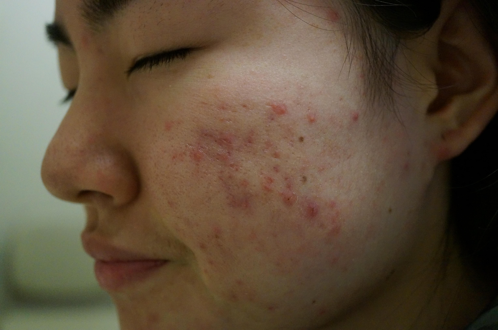

</div>

## Description
First part of project project is focused on detecting acne in facial images using the YOLOv7 object detection model.
We used [this](https://github.com/WongKinYiu/yolov7) YOLOv7 implementation.

## Installation and environment

#### Pip

```bash
# clone project
git clone https://github.com/lqrhy3/skin-disease-recognition.git
cd skin-disease-recognition/src/models/yolov7

# [OPTIONAL] create conda environment
conda create -n yolov7
conda activate yolov7

# install requirements
pip install -r requirements.txt
```

## Dataset
We used the acne04 dataset for this project, which can be downloaded from the following page: [link](https://github.com/xpwu95/LDL). The dataset consists of facial images with corresponding bounding boxes for acne.

## Preparing data

```bash
# converting raw Acne04 dataset to VOC format
python3 src/data/convert_acne04_to_voc.py --raw_data_dir <path to raw Acne04 dataset> --baked_data_dir <destination folder>

# converting voc to yolo format
python3 src/data/convert_acne04_voc_to_yolo.py --voc_data_dir <path to acne dataset in voc format> --baked_data_dir <destination folder>

# splitting on train and validation part. this script creates train.txt and val.txt
python3 src/data/split_yolo.py --yolo_data_dir <path to yolo format dataset>
```

## Visualizing
```bash
# visualizing acne dataset in VOC format
python3 src/visualization/fiftyone_acne04_voc.py --data_dir <path to data>

# visualizing acne dataset in yolo format
python3 src/visualization/fiftyone_acne04_yolo.py --data_dir <path to data>

# visualizing yolo predictions
python3 src/visualization/fiftyone_acne04_yolo_preds.py --source <path to data> --weights <path to yolo weights> --device <cpu or cuda> --img-size  --conf_thres <object confidence thr> --iou_thres <IoU thr for NMS>
```

## Training and evaluating
Instructions for training and evaluating YOLOv7 can be found in original [repository](https://github.com/WongKinYiu/yolov7).


## Results

<p align="center">
  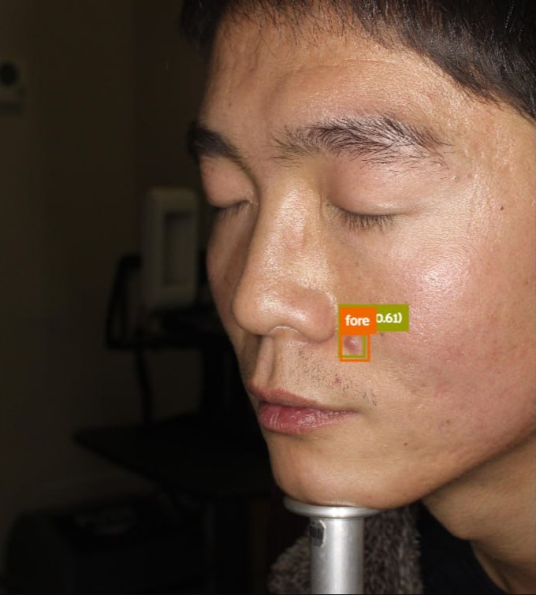
  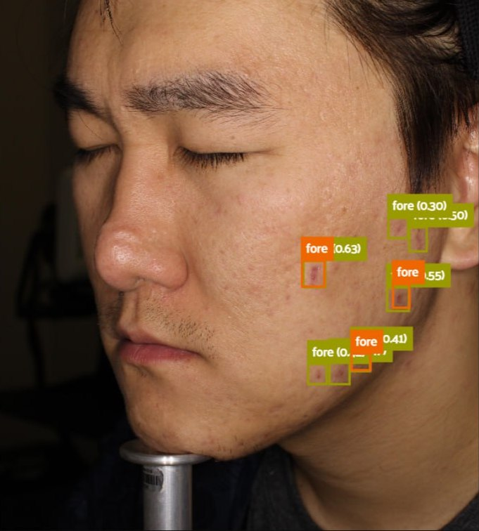
  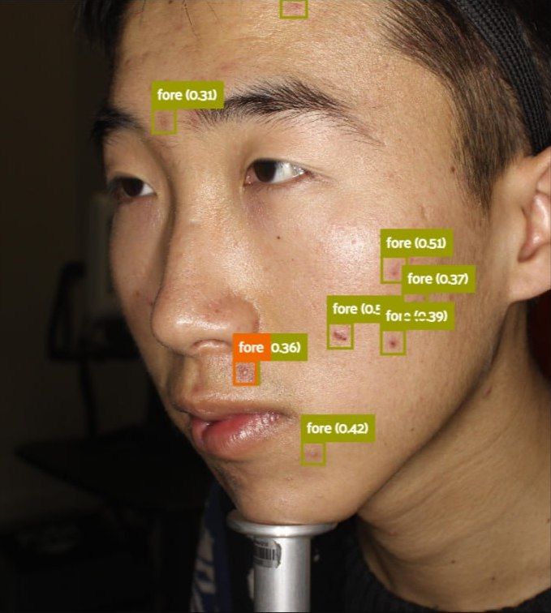
</p>

<p align="center">
  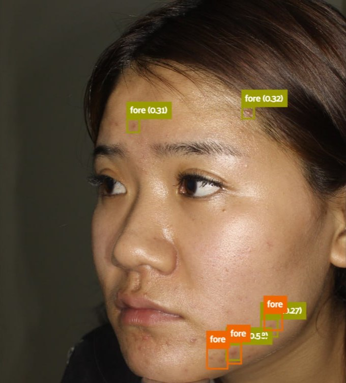
  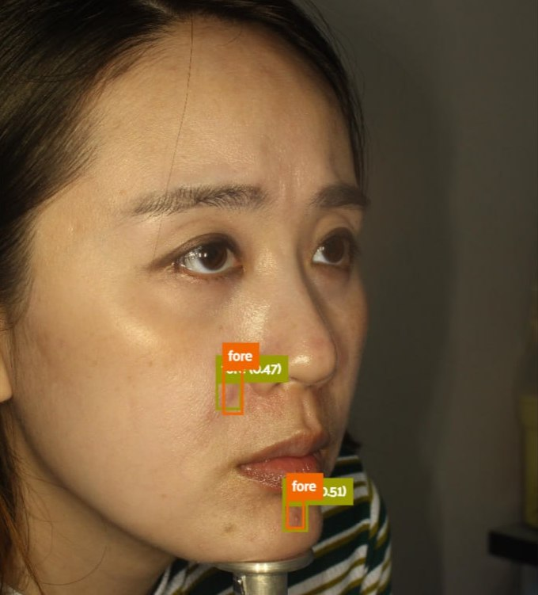
  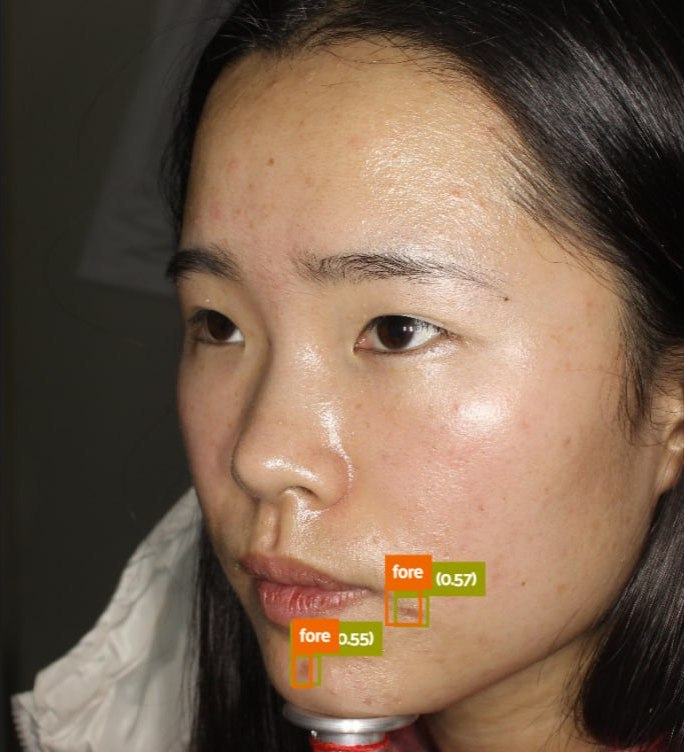
</p>

______________________________________________________________________

<div align="center">

# Dark circles under the eyes recognition


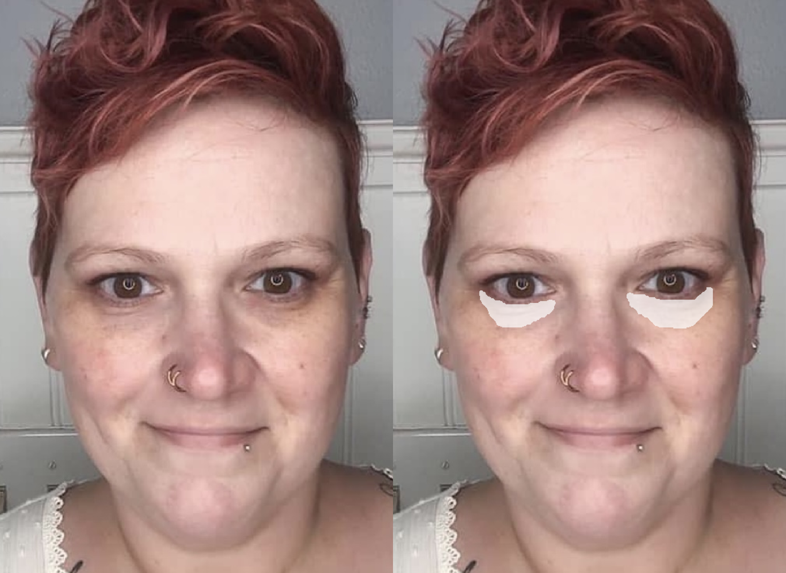
</div>


## Description
This part focused on developing a solution for recognizing dark circles under the eyes on face images. 
Due to data privacy concerns, we are unable to share the dataset we used in this project.


## Approach
Initially, we tried using the UNet-like architecture for this task, 
but we did not achieve good results, cause of low quality of ground truth masks. 
Therefore, we decided to use a unsupervised no-ML approach from [this](https://e-century.us/files/ijcem/12/5/ijcem0084644.pdf) paper, 
and it performed well for our dataset.

## Installation

#### Pip

```bash
# clone project
git clone https://github.com/lqrhy3/skin-disease-recognition.git
cd skin-disease-recognition

# [OPTIONAL] create conda environment
conda create -n skin-disease-project
conda activate skin-disease-project

# install requirements
pip install -r requirements.txt
```

## Evaluating

```bash
python3 src/eval_noml_classification.py --data_dir <data_dir> --path_to_landmarks_predictor <landmarks_predictor>
```

[Link](https://github.com/davisking/dlib-models/blob/master/shape_predictor_68_face_landmarks.dat.bz2) to dlib landmarks predictor


## Results
<div align="center">

|         <!-- -->          |         <!-- -->          |         <!-- -->          |
|:-------------------------:|:-------------------------:|:-------------------------:|
| 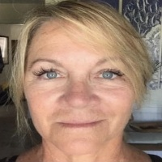 |  | 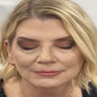 |
|   $y = 0; \hat{y} = 0$    |   $y = 0; \hat{y} = 0$    |   $y = 0; \hat{y} = 0$    |
| 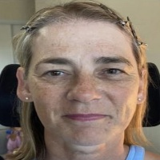 | 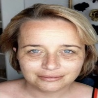 |  |
|   $y = 1; \hat{y} = 1$    |   $y = 1; \hat{y} = 1$    |   $y = 1; \hat{y} = 1$    |

</div>


---------------------------------------------------------------

## Segmentation approach

## Data
Dataset contains a folder with facial images and a corresponding folder with segmentation masks for dark circles under the eyes. 
In order to process the dataset, we used morphological opening and closing techniques to remove noise from the masks. 

```bash
python3 src/data_process_data_circles.py --raw_data_dir <raw dataset folder> --processed_dir <destination folder>
```

## Training

```bash
python3 src/train.py experiment=unet_baseline.yaml
```

## Evaluating
```bash
python3 src/eval_segmentation.py ckpt_path=<path to cktp> output_dir=<path to save predictions>

```

## Visualization
```bash
# visualize dataset dark_circles, data_dir should contain 'data/' and 'labels/' folders
python3 src/visualization/fiftyone_dark_circles.py --data_dir <path to data folder>

# visualize dataset with predicted masks
python3 src/visualization/fiftyone_dark_circles_pred.py --data_dir <path to data folder> --preds_dir <path to predictions folder>
```

______________________________________________________________________

# Contributors 
This project was completed by [Stanislav Mikhaylevskiy](https://github.com/lqrhy3), 
[Victor Pavlishen](https://github.com/vspavl99) and [Vladimir Chernyavskiy](https://github.com/JJBT). If you have any questions or suggestions regarding this project, please feel free to contact us.
